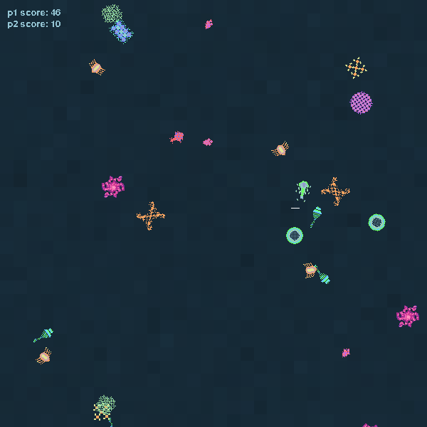

# Microbes, a life in ten seconds.

Microbes was created in half a day for Ludum Dare 27, 2013.
I hope you have fun playing it :)

* you are a microbe with a 10 second lifespan.
* eat green/blue microbes to extend your life.
* avoid red/pink microbes who steal your life.
* score is determined by the number of seconds you stay alive, plus the amount of microbes you ate.
* two player hotseat for your friends.

# Requirements

Python 2.7 with PyGame.

## For *nix flavors

apt users can simply install with:

    sudo apt-get install python-pygame

Please substitute your favorite package manager when appropriate :-)

## For Windows

Install Python from http://python.org/ and PyGame from http://pygame.org/

**Important to note** that even if you run a 64-bit architecture, install the 32-bit editions of both these.

## Run

Run with the obvious:

    python microbes.py

## Tools

* Geany code editor and bash terminal
* GIMP for graphics
* MilkyTracker for music

Resources were created by me, from scratch.

# License

This program is free software: you can redistribute it and/or modify
it under the terms of the GNU General Public License as published by
the Free Software Foundation, either version 3 of the License, or
any later version.

This program is distributed in the hope that it will be useful,
but WITHOUT ANY WARRANTY; without even the implied warranty of
MERCHANTABILITY or FITNESS FOR A PARTICULAR PURPOSE.  See the
GNU General Public License for more details.

You should have received a copy of the GNU General Public License
along with this program. If not, see http://www.gnu.org/licenses/.
